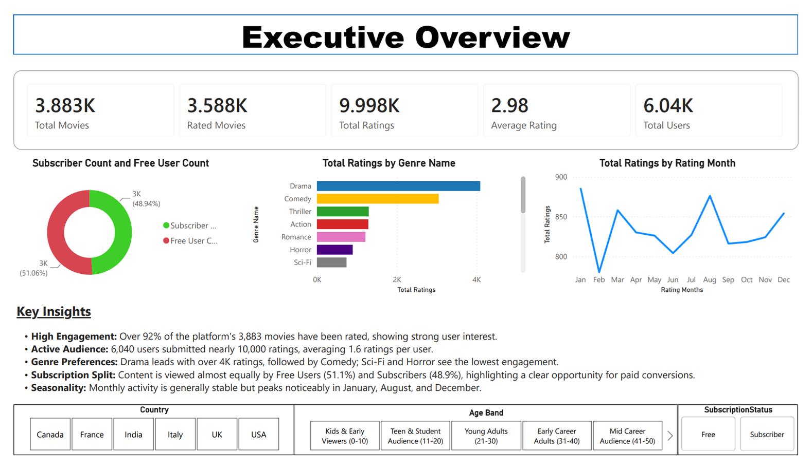
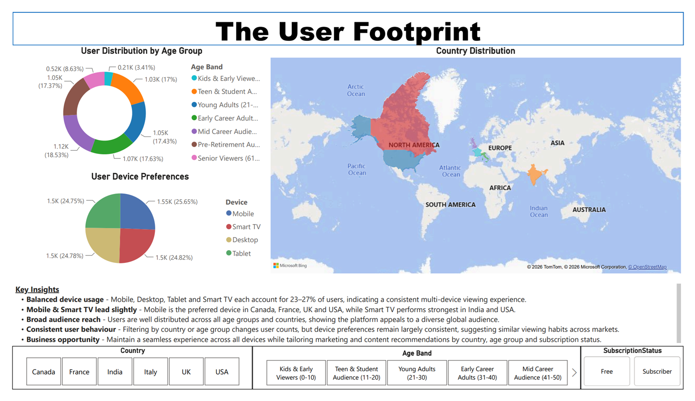
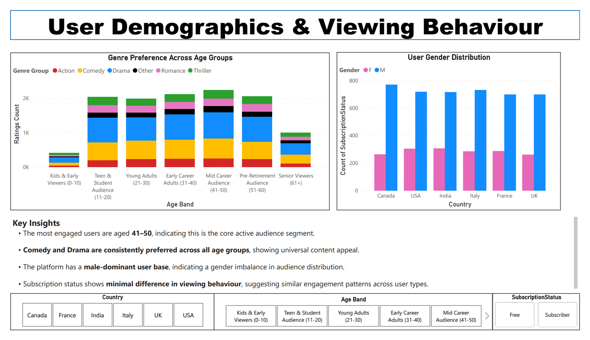
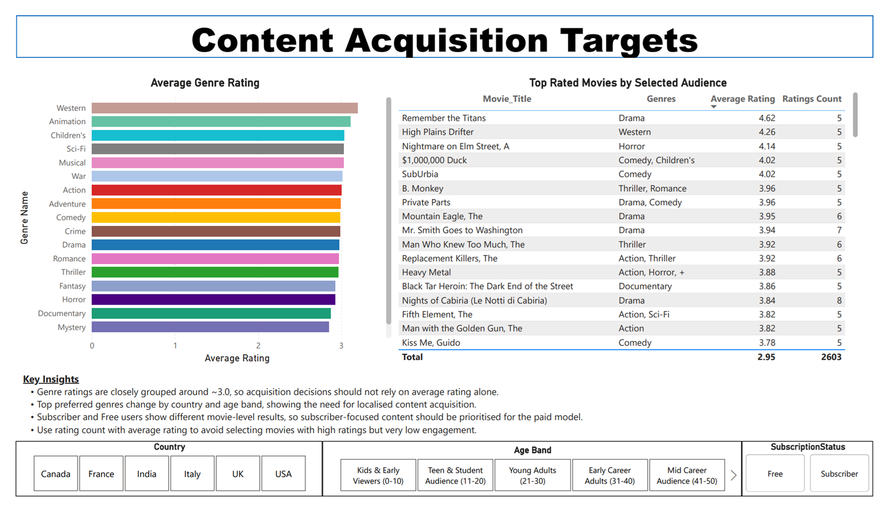
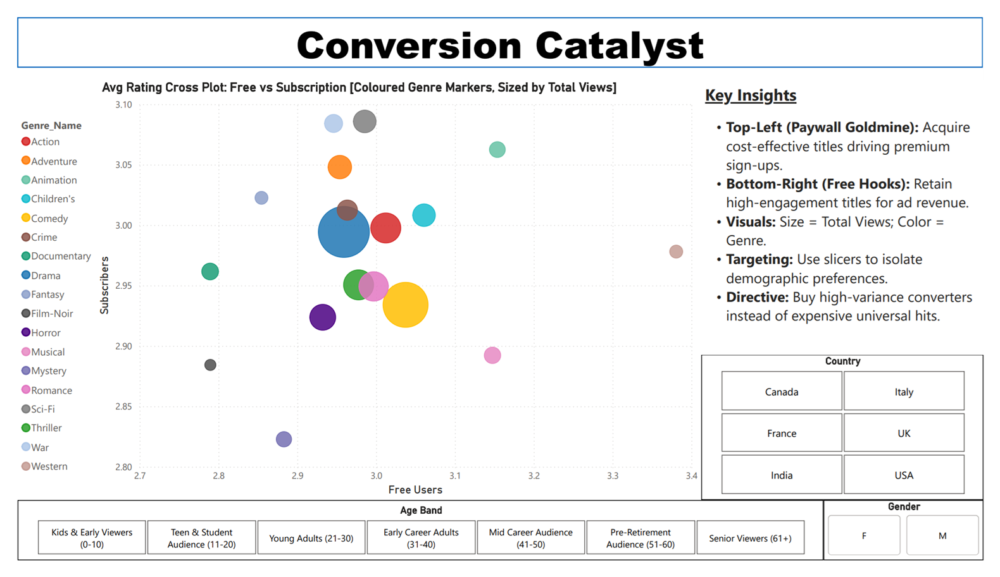

# Project Story: From Data to Conversion Strategy

## Context

StreamFlix is an international streaming platform pivoting from a free, ad-supported model to a premium subscription business. The leadership team needed a **data-driven content acquisition strategy** that would:

- Retain existing free users and protect ad revenue.
- Attract and convert new premium subscribers.
- Avoid overpaying for “universal hits” that don’t materially move conversion.

Our team operated as a data consulting group, delivering:

- A normalized MySQL data model for users, movies, ratings, and genres.
- An interactive Power BI dashboard for scenario-based acquisition planning.
- A clear strategic narrative for the premium pivot.

---

## Executive Overview

The Executive Overview dashboard establishes the scale and health of the platform:

- **High engagement:** Over 92% of the platform’s 3,883 movies have been rated, indicating strong user interest.
- **Active audience:** 6,040 users submitted nearly 10,000 ratings, averaging around 1.6 ratings per user.
- **Genre preferences:** Drama leads engagement with over 4K ratings, followed by Comedy; Sci‑Fi and Horror show the lowest engagement.
- **Subscription split:** The user base is split almost evenly between Free and Subscriber accounts, suggesting there is room to grow the premium tier without sacrificing free‑tier reach.
- **Seasonality:** Monthly activity is relatively stable but peaks in January, August, and December.

This view frames the core challenge: StreamFlix has a healthy, engaged base, but needs to convert more of that engagement into premium subscriptions.

---

## The User Footprint

The User Footprint dashboard shows who the audience is and how they watch:

- **Balanced age distribution:** Users are well distributed across age bands, with a particularly strong mid‑career segment.
- **Device parity:** Mobile, Smart TV, Desktop, and Tablet each account for roughly 23–27% of users, indicating a consistent multi‑device experience.
- **Global reach:** Users are spread across countries with relatively tight clustering, showing broad international appeal.
- **Consistent behaviour:** Filtering by country or age band changes user counts, but device preferences remain similar, suggesting comparable viewing habits across markets.

This view supports a platform delivery strategy focused on a seamless experience across all devices, with regional tuning rather than radical redesigns.

---

## Audience Insights

The Audience Insights dashboard deepens the demographic story:

- **Core active audience:** The most engaged users are aged 41–50, making this the key segment for premium targeting.
- **Genre stability:** Comedy and Drama are consistently preferred across all age groups, providing reliable, universal appeal.
- **Gender imbalance:** The platform has a male‑dominant user base, which may influence genre and marketing decisions.
- **Subscription behaviour:** Free and Subscriber users show minimal difference in overall viewing patterns, suggesting that conversion depends on *which* titles are offered, not just *how much* they watch.

These insights help StreamFlix decide where to focus premium acquisition and marketing efforts: mid‑career audiences, with genre strategies tailored to demographic nuance.

---

## Content Acquisition Targets

The Content Acquisition Targets dashboard translates audience understanding into buying decisions:

- **Tight rating band:** Average genre ratings cluster around roughly 3.0, meaning acquisition should not rely on rating alone.
- **Localised preferences:** Top preferred genres change by country and age band, underscoring the need for regional catalog design rather than global, undifferentiated choices.
- **Free vs subscriber contrast:** Free and Subscriber users can show different movie‑level results, so subscriber‑focused content should be prioritised for the paid model.
- **Volume plus quality:** Rating count must be considered alongside average rating to avoid choosing titles that are highly rated but barely watched.

This view sets the stage for the key question: not just “what’s popular?”, but “what actually drives premium conversion in each segment?”

---

## The Conversion Catalyst

The centerpiece of the strategic story is the **Conversion Catalyst**.

### The Business Question

> “Exactly what type of content makes a free user pull out their credit card?”

### The Visual

- **X-axis:** Average rating by **Free** users.
- **Y-axis:** Average rating by **Subscribers** for the same movie.
- **Bubble size:** Total views (scale of opportunity).
- **Bubble color:** Genre.

By plotting titles in this space, four strategic quadrants emerge.

### The Four Quadrants

- **Top‑Right: Universal Crowd‑Pleasers**  
  Loved by both Free and Subscriber users.  
  Good for overall platform health, but often expensive and not the most efficient lever for conversion.

- **Bottom‑Left: Dead Weight**  
  Low engagement from both segments.  
  Not a priority for acquisition spend.

- **Bottom‑Right: Free‑Tier Hooks**  
  High free ratings, low subscriber ratings.  
  **Strategy:** Keep these on the free tier to maximise ad revenue and maintain a wide top‑of‑funnel.

- **Top‑Left: Paywall Goldmine**  
  Low free ratings, high subscriber ratings.  
  **Strategy:** Acquire and lock these behind the paywall to drive new subscriptions. These are the true **conversion catalysts**.

### Targeting High‑Value Segments

Using demographic and regional slicers, the Conversion Catalyst shows how the “Paywall Goldmine” shifts by audience:

- **Overall:** Sci‑Fi, War, Fantasy, and Documentaries (with Drama outperforming Comedy for conversion) emerge as strong premium genres.
- **By market:**  
  - Italy → Film‑Noir  
  - UK → Documentary & Crime
- **By demographic:**  
  - Males → War, Documentary, Film‑Noir  
  - Young Adults (21–30) → War  
  - Mid‑Career Audience (41–50) → Sci‑Fi & Documentaries  
  - Pre‑Retirement Audience (51–60) → Fantasy  
  - Senior Viewers (61+) → Animation

This demonstrates that StreamFlix should **not** buy content as a monolith. Instead, it should use the dashboard to build **localized, demographic‑specific catalogs**, tuned to the segments that matter most.

---

## Strategic Takeaways

Synthesising the analysis across all dashboards, we proposed three strategic pillars for the premium pivot.

### 1. Content Acquisition

- Prioritise **high‑variance titles** that convert subscribers (Paywall Goldmine), rather than simply buying what is globally popular.
- Maintain a strong **Drama/Comedy library on the free tier** to protect ad revenue and keep the top of funnel wide.
- Use both **rating count and average rating** to avoid over‑indexing on niche titles with low engagement.

### 2. Audience Targeting

- Hyper‑target the **35–54 age band**, identified as the core engaged audience segment.
- Use country and age‑band slicers to design **regional catalogs** instead of relying on global averages.
- Incorporate gender and demographic insight (e.g. male‑dominant base, age‑specific genre preferences) into campaign and acquisition planning.

### 3. Platform Delivery

- Device usage is nearly perfectly balanced across Mobile, Smart TV, Desktop, and Tablet.
- Maintain a **seamless, consistent UI** across all devices to support multi‑device viewing.
- Optimise marketing and UX by region (e.g. mobile‑first where mobile leads; Smart TV focus where large‑screen viewing dominates).

---

## Closing

By aligning acquisition budgets, audience targeting, and platform delivery with these insights:

- StreamFlix can maximise **subscription conversions** through targeted, high‑variance content.
- Protect and grow **ad revenue** via a robust, engaging free‑tier catalog.
- Deliver a **consistent, region‑aware experience** across devices and markets.

The interactive Power BI dashboards remain as a living tool for the acquisition and marketing teams, enabling them to continue refining strategy as user behaviour evolves.